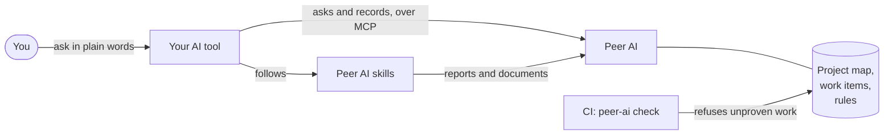

# Peer AI

**Keeps AI coding tools to the standard of a careful senior team, from the first brief to production, and proves it.**

[](https://github.com/AbuMahir980/peer-ai/actions/workflows/ci.yml)
[](LICENSE)

AI coding tools such as Claude Code, Codex, Cursor and GitHub Copilot write code fast. Left to themselves, they skip what makes software safe to ship: nobody writes down what's being built, security and privacy get checked when someone remembers, tests prove less than they claim, and "done" means "the AI said so".

Peer AI gives every AI tool the same way of working: the plans, the checklists, the rules and the reviewer a good engineering team would have. It checks that each one was followed, and keeps the proof. You keep using the AI tool you like. Peer AI makes sure its work is planned, tested, secure and compliant before it reaches your users.

> **Status: pre-release.** Peer AI 1.0 is being proven on real projects before its first stable release. Everything described here is built and tested in this repository. Report anything that goes wrong: see [Feedback](#feedback).
>
> **Needs Node.js 24 or newer,** on macOS, Linux or Windows, and git. Check with `node --version`.

## Contents

- [Who it's for](#who-its-for)
- [What it does for a project](#what-it-does-for-a-project)
- [How it works](#how-it-works)
- [Proof, not promises](#proof-not-promises)
- [Rules and standards](#rules-and-standards)
- [Strictness that follows the stage](#strictness-that-follows-the-stage)
- [Works with your AI tools](#works-with-your-ai-tools)
- [Quickstart](#quickstart)
- [Privacy](#privacy)
- [The 29 skills](#the-29-skills)
- [What's in this repository](#whats-in-this-repository)
- [Contributing](#contributing)
- [Feedback](#feedback)
- [License](#license)

## Who it's for

- **Developers and small teams building with AI tools,** who want the AI's work held to a professional standard without writing that standard themselves.
- **Products that handle money, health or personal data,** where a missed check becomes a breach, a fine or harm to a person.
- **Anyone who has to show how software was checked,** to a client, an auditor or a future teammate: every review leaves a record of what it looked at and what it found.
- **Projects at any point.** A brief with no code, a prototype, or a product already in production with no documents at all.

## What it does for a project

Peer AI covers the whole life of a product. Each area below is handled by one or more **skills**: step-by-step procedures your AI tool follows, each ending in a document or a report that Peer AI checks.

| Area | What Peer AI makes sure of |
|------|----------------------------|
| **Planning** | Requirements written from a brief, a request or the code itself; an architecture with its decisions recorded; product specs with acceptance criteria; system and API design; the data model; a design system. Work is planned as small items, each with a goal, acceptance criteria and the items it depends on. |
| **Building** | Each item is built from its acceptance criteria, with tests written first, the smallest change that meets them, and the project's own verify command run and recorded by Peer AI. |
| **Testing** | A test strategy that names the journeys and rules that must never break and the test that proves each one; abuse tests that attack the product's own code; a tester's check of every acceptance criterion before anything ships. |
| **Security** | Reviews built on the OWASP standards: who may see and change each record, input and output, secrets, sessions, transport, uploads, phone apps and AI features. A threat model that says what could go wrong and what stops it, with evidence from the code. Secret scanning, dependency checks and code scanning in CI. |
| **Privacy and compliance** | What personal data is collected, where it goes, consent, logs, how long it's kept, and card details that must never touch your servers. Signals from the code about which laws and standards apply, such as the data protection law where you operate or PCI DSS. |
| **Accessibility and design** | Keyboard, screen readers, labels, colour and contrast, text size and touch targets, based on WCAG 2.2; design tokens and shared components with every state they need. |
| **Performance and reliability** | Slow queries, unpaged lists, slow work inside requests, memory leaks, oversized images; timeouts, retries that are safe to repeat, offline use, and apps that still update after they're cached. |
| **APIs and data** | An API that does what its contract says, field by field; changes that don't break clients; database migrations and on-device data that never lose what people saved. |
| **Releases and operations** | A release check before anything reaches people: every item's gates, a way back at each step, safe data changes. Infrastructure with environments kept apart and nothing public by accident. Logs, health checks and alerts. A calm, recorded response when something breaks in production. |
| **Keeping the code healthy** | Dependency reviews (known vulnerabilities, licences, risky packages), technical debt found and ranked by what it costs and risks, and a README a newcomer can follow. |

## How it works

Peer AI is one npm package. It gives you a command-line tool, `peer-ai`, and it gives your AI tool a connection to Peer AI through the Model Context Protocol (MCP), the standard way AI tools talk to other software.



1. **`peer-ai init`** reads your repository (its languages, frameworks, parts, infrastructure, CI and AI tools) and writes one config file, `peer-ai.config.json`. It asks only what it can't work out.
2. **`peer-ai assess`** maps what the project already has, such as requirements, a threat model, tests or observability, and what its stage still needs. Each item is present, partial or missing, with the files that prove it. Gaps become work to do, never a red build.
3. **`peer-ai render`** connects each AI tool you use: short instructions, the MCP server, and Peer AI's skills, written where each tool reads them.
4. **You ask your AI tool for work in plain words,** such as "add booking cancellations" or "review the payments code". It asks Peer AI what to do next, follows the skill for the job, checks every rule that applies, and records what it did. Peer AI refuses a record the evidence doesn't support.
5. **`peer-ai check` runs in CI** and fails when a piece of work claims more than its record shows: no recorded verify, a failed or incomplete review, or, in production, a review it needed and never had.

Your project keeps one config file, a `.peer-ai/` folder with its map, work items and review reports, and a few lines in each AI tool's settings. The skills are rebuilt from the installed version and stay out of git, so upgrading Peer AI is a one-line version change.

## Proof, not promises

An AI tool saying "I checked the security" isn't evidence. Peer AI asks for evidence and checks it:

- **Every review proves what it covered.** It lists everything it looked at (each route, screen, job and upload), gives every rule a line with the file and line that show it holds, and describes each problem with its harm, its evidence and a fix. Peer AI refuses a report that skips a rule, or claims a pass its findings don't support.
- **Verify is run, not claimed.** Peer AI runs the project's own verify command and records the result.
- **Documents are checked too.** A requirements document, a threat model or a test strategy must fill every part of its template before Peer AI accepts it.
- **The skills are tested.** Each skill is run against practice projects with problems planted on purpose, and scored on what it finds. The results, including where a skill still falls short, are published in [`evals/README.md`](evals/README.md).

### With and without Peer AI

Frontier models are capable, and Peer AI doesn't make them smarter. It makes them thorough and accountable: the whole checklist every time, and no "done" without proof. Here is the same model, Claude Sonnet, on the same practice project, asked the same thing with and without Peer AI:

| Asked for | Without Peer AI | With Peer AI |
|-----------|-----------------|--------------|
| A release check before a launch | 8 of 12 problems found | 12 of 12 |
| A test strategy | 3 of 9 points made | 8 of 9 |
| A README for a newcomer | 4 of 7, and refused by the document check | 7 of 7 |
| An accessibility review | 4 of 5 problems | 5 of 5 |
| A performance review | 2 of 3 | 3 of 3 |
| A dependency review | 3 of 4 | 4 of 4 |
| A check of an API against its contract | 6 of 8 | 7 of 8 |
| A tester's check of a built feature | 4 of 5 | 5 of 5 |
| A security review of a project built after the skills were written | 15 of 16, missing a serious problem | 16 of 16 |

On six other reviews the model did as well on its own: infrastructure, reliability, compliance, data migrations, design and observability. Even there, Peer AI was often cheaper, as with the infrastructure review at half the cost. And without Peer AI, no review could show which rules it had checked; with it, every rule has a line and its evidence. Every run, with its cost, is in [`evals/README.md`](evals/README.md).

## Rules and standards

Peer AI's standards are **197 rules**, each with an id such as `SEC-07`, a plain statement, why it matters, the stage it applies from, how it's checked, and how serious a break is. Security rules cite the published standard they come from: OWASP ASVS 5.0 for web apps and APIs, OWASP MASVS for phone apps, WCAG 2.2 for accessibility, and the OWASP Top 10 for LLM applications for AI features.

| Area | Rules | | Area | Rules |
|------|------:|-|------|------:|
| Security | 30 | | Frontend | 9 |
| Design and accessibility | 16 | | Reliability | 9 |
| Code quality | 16 | | Architecture | 8 |
| Infrastructure and operations | 15 | | API design | 8 |
| Delivery | 12 | | AI features | 8 |
| Money (for products that handle it) | 12 | | Performance and caching | 7 |
| Testing | 11 | | System design and scalability | 6 |
| Mobile | 6 | | Privacy and compliance | 6 |
| Safety-critical data (for products that need it) | 6 | | Requirements, data | 5 each |
| Backend | 2 | | | |

**How each rule is checked:** 46 by a tool that fails the build, such as a linter or a scanner; 148 by an AI review that must prove what it checked; and 3 by a person, for decisions only a person can make, such as accepting a risk or granting access to production.

**Stack profiles** say how to follow the rules in a particular stack, and which tool enforces each automatic rule:

| Profile | Enforced by |
|---------|-------------|
| TypeScript, Node, React, React Native, Next.js, Express, NestJS, Fastify | ESLint (through the `peer-ai-eslint-config` package) and the TypeScript compiler |
| Python, FastAPI | Ruff |
| GitHub Actions | A security pipeline Peer AI writes: Gitleaks for secrets, OSV-Scanner for vulnerable dependencies, zizmor for workflows, Semgrep for code, SSLyze for TLS, and OWASP ZAP against a running test environment |

A project can set a rule aside, with a reason and the name of the person who decided, or change one of its numbers, such as how long a function may grow. `peer-ai doctor` lists every such decision, so nothing is switched off silently. See [`packages/standards`](packages/standards) for every rule.

## Strictness that follows the stage

A project says what stage it's at, and Peer AI asks for what that stage needs, and no more:

| Stage | What it asks for |
|-------|------------------|
| **Prototype** | Nothing is required. Serious problems are still reported, and the basics, such as no secrets in code, apply from day one. |
| **MVP** | Requirements, an API contract, CI, tests, a threat model, a record of the personal data it holds, and a README. Each change gets the reviews it needs, such as a security review for code, with a warning when one is skipped. |
| **Production** | Everything above, plus architecture, specs, a data model, a data protection impact assessment, design, written standards, separate environments, infrastructure, observability, service targets, runbooks and load testing. A skipped review stops the release. |

It also shows what the next stage will need, so nothing arrives as a surprise.

## Works with your AI tools

| AI tool | How Peer AI connects |
|---------|----------------------|
| Claude Code | Instructions in `CLAUDE.md`, the MCP server in `.mcp.json`, skills in `.claude/skills/` |
| OpenAI Codex | Instructions in `AGENTS.md`, skills in `.agents/skills/`, and the one command to register the MCP server |
| Cursor | A rule in `.cursor/rules/`, the MCP server in `.cursor/mcp.json` |
| GitHub Copilot | Instructions in `.github/copilot-instructions.md`, the MCP server in `.vscode/mcp.json` |
| Gemini CLI | Instructions in `GEMINI.md`, the MCP server in `.gemini/settings.json` |
| Any other tool | `AGENTS.md`, the open instructions file most AI tools read |

The skills follow the open [Agent Skills](https://agentskills.io) format, so every tool that reads skills gets the same procedures. A team can mix tools: one config drives them all. Cloud agents get a setup step that writes the skills before they start.

## Quickstart

You need Node.js 24 or newer, git, and an AI tool. Peer AI runs on macOS, Linux and Windows.

```bash
npx peer-ai init
npx peer-ai assess
npx peer-ai render
```

Then open the project in your AI tool and ask for work in plain words, such as "what should we work on next?" or "review this change".

`render` also sets up the gate in your CI: `peer-ai check`, which holds every change to its record. On GitHub Actions it writes `.github/workflows/peer-ai.yml`, which works with or without a `package.json`; for any other CI, it prints the step to add. Make `peer-ai check` a required check in your repository's settings, so nothing merges without it.

**Moving from v0?** If your project has a `peer-ai/` folder from the old playbook, run `npx peer-ai migrate` instead of `init`. It moves your settings into the config and leaves a list of anything that needs your decision.

You never have to remember to check the setup: `peer-ai check` in CI fails when the setup stops working, and your AI tool hears about any problem at the start of each session and fixes it or tells you. `npx peer-ai doctor` shows the details at any time. Every command is described in [`packages/peer-ai`](packages/peer-ai).

## Privacy

Peer AI runs on your machine and in your CI. It sends nothing anywhere, and it has no telemetry. Your AI tool talks to its own model provider as it always does; Peer AI adds nothing to that. The only thing that ever leaves your project is a feedback report you approve.

## The 29 skills

Each skill is a procedure an AI tool follows, and each ends in something Peer AI checks.

<details>
<summary><strong>15 reviews</strong>: each ends in a report that proves every rule was checked</summary>

| Skill | What it checks |
|-------|----------------|
| `security-review` | Security holes and personal-data leaks, against OWASP-based rules |
| `code-review` | Bugs and maintainability: lost data, races, API breaks, slow queries, leaks, code quality |
| `ai-feature-review` | Features that use AI models: what's sent, what can steer the model, what its output can do |
| `compliance-review` | Personal data and card payments: what's collected, where it goes, consent, retention |
| `accessibility-review` | Keyboard, screen readers, labels, colour, contrast, text size, touch targets, motion |
| `design-review` | Tokens, shared components and their states, contrast and text size |
| `contract-check` | That an API does what its contract says, route by route and field by field |
| `data-migration-review` | Changes to stored data, on servers and on devices, for anything lost or broken |
| `dependency-review` | Versions and lockfiles, known vulnerabilities, licences and risky packages |
| `performance-review` | Queries per row, unpaged lists, slow work in requests, leaks, oversized images |
| `reliability-review` | Timeouts, failures, repeatable jobs, offline use, updates and safe configuration |
| `infrastructure-review` | Environments kept apart, access, what the internet can reach, secrets, backups |
| `observability-review` | Logs, request ids, health checks, alerts, security events and service targets |
| `qa-acceptance` | A built item against its acceptance criteria, as a tester would |
| `release-readiness` | A release before it reaches people: gates, checks, a way back, safe data changes |

</details>

<details>
<summary><strong>10 documents</strong>: each fills a template that Peer AI checks</summary>

| Skill | What it writes |
|-------|----------------|
| `requirements-analysis` | Requirements from a brief, a request or the code |
| `architecture` | The parts, what each owns, how they depend on each other, and each decision with its options |
| `product-spec` | A feature's spec: who can do what, every journey and screen, acceptance criteria and edge cases |
| `system-design` | How a feature is built across the system, including failures and people acting at once |
| `api-design` | An API: who may call each endpoint, typed requests and responses, errors, paging, safe retries |
| `data-modelling` | The data model: entities, guarantees, personal data and how long it's kept |
| `design-system` | Tokens, shared components with all their states, and the accessibility every screen keeps |
| `threat-model` | The ways in, what can go wrong through each, and what stops it, with evidence from the code |
| `test-strategy` | Which test proves each journey and rule, abuse tests, test data and what runs on every change |
| `documentation` | The README a newcomer needs, checked against the code |

</details>

<details>
<summary><strong>4 work skills</strong>: each moves work forward and records it</summary>

| Skill | What it does |
|-------|--------------|
| `issue-planning` | Plans a feature or the project's gaps as small work items, in the order they can ship |
| `implement-ticket` | Builds a work item from start to ship: tests first, the smallest change, a proven verify, the reviews it needs |
| `incident-response` | Handles a production incident, from first report to lessons learned |
| `tech-debt-triage` | Finds technical debt and ranks it by what it costs and risks against what fixing takes |

</details>

You rarely name a skill yourself. Peer AI picks the skill for each gap, and works out which reviews a change needs from the files it touched: a security review for code at MVP and beyond, an accessibility review for screens, a data-migration review for migrations, and so on.

## What's in this repository

| Folder | What it holds |
|--------|---------------|
| [`packages/peer-ai`](packages/peer-ai) | The `peer-ai` command and the MCP server: what people install |
| [`packages/workflow`](packages/workflow) | Shared definitions: the config format, work items, review reports and their schemas |
| [`packages/standards`](packages/standards) | The 197 rules and the stack profiles, as data, with a page for each area |
| [`packages/skills`](packages/skills) | The 29 skills, and the code that builds and validates them |
| [`packages/eslint-config`](packages/eslint-config) | ESLint settings that enforce a project's stack profiles |
| [`fixtures`](fixtures) | Practice projects with problems planted on purpose, used to test the skills |
| [`evals`](evals) | Answer sheets for the practice projects, and every skill's results |
| [`rfcs`](rfcs) | Written designs for every significant change, and the decision on each |
| [`scripts`](scripts) | Tools for this repository: the eval runner, the install proof, the forbidden-terms check |

## Contributing

Peer AI is looking for contributors. You don't need to know the whole project to help:

- **Add a stack profile** for a stack you know, such as Django, Rails, Go, Flutter or Spring, with the tool that enforces each rule.
- **Add a rule** you've seen missed in real projects, with the published source it comes from and a planted problem that tests it.
- **Build a practice project** in a stack the evals don't cover yet.
- **Connect another AI tool.**
- **Report where Peer AI got it wrong:** a missed problem, a wrong finding, a confusing step. These reports are what improve it most.

Read [CONTRIBUTING.md](CONTRIBUTING.md) to get started, and the [code of conduct](CODE_OF_CONDUCT.md). Significant changes start as an [RFC](rfcs), so the design is agreed before the work. Security issues go through [SECURITY.md](SECURITY.md), never a public issue.

To work on Peer AI itself, you need Node 24 (see `.nvmrc`) and pnpm 12:

```bash
pnpm install
pnpm verify
```

`pnpm verify` checks formatting, lints, type-checks and runs the tests, as CI does.

## Feedback

When Peer AI gets something wrong in your project, such as a review that misses a problem or a check that blocks you by mistake, your AI tool drafts a report for you. At a natural stopping point it shows you each draft and asks whether to send it; only after your yes does `peer-ai feedback send` open it as an issue here. A report never holds your code: Peer AI refuses a draft with code, keys or email addresses.

You can also [open an issue](https://github.com/AbuMahir980/peer-ai/issues/new/choose) yourself. Include the Peer AI version, the AI tool, the skill and what you expected; leave out private code and names.

## License

[MIT](LICENSE). Use it, change it and ship it, in any project.
